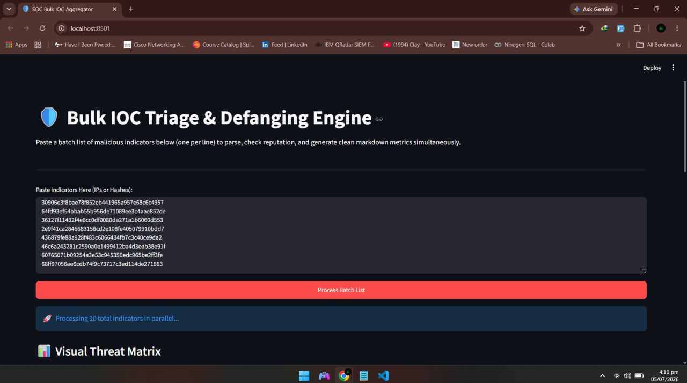
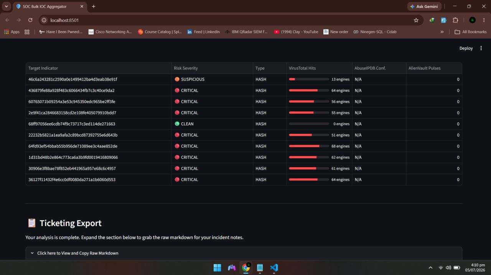
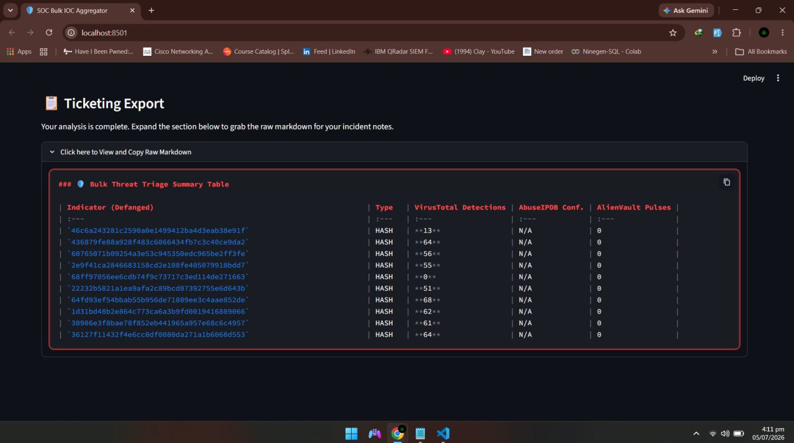

# 🛡️ SOC Bulk IOC Aggregator & Triage Engine

As a SOC Analyst, I built this tool to automate the tedious process of initial threat triage. Instead of manually querying individual IPs and file hashes across multiple browser tabs, this Python application processes bulk indicators concurrently, visualizes the risk, and generates a defanged markdown report ready for ticketing systems (like Jira or TheHive).

---

## 📸 Dashboard Preview

### 1. The Threat Matrix Interface
*A clean, Streamlit-powered UI allowing bulk input and visualizing risk levels with progress bars.*

### 2. Defanged Ticketing Export
*One-click generation of perfectly aligned, defanged Markdown tables ready to be pasted into incident notes.*

### 3. Concurrent Processing Output
*Fast execution of multiple IOCs hitting VirusTotal, AbuseIPDB, and AlienVault OTX simultaneously.*

---

## 🚀 Features
* **Bulk Processing:** Paste dozens of IOCs at once; the engine auto-detects if they are IPv4 addresses or File Hashes.
* **Concurrent API Queries:** Hits VirusTotal, AbuseIPDB, and AlienVault OTX simultaneously using Python multithreading.
* **Visual Threat Matrix:** Built with Streamlit, the UI dynamically calculates risk levels and renders progress bars for malware engine hits.
* **One-Click Ticketing:** Automatically defangs malicious indicators (e.g., `8.8.8.8` to `8[.]8[.]8[.]8`) and generates perfectly aligned, copy-pasteable Markdown tables.

## 🛠️ Skills Demonstrated
* Security Automation & SOAR Concepts
* Python (Multithreading, Regex, Data manipulation with Pandas)
* REST API Integration & JSON Parsing
* Frontend UI Development (Streamlit)

## How to Use
1. Clone the repository.
2. Install requirements: `pip install -r requirements.txt`
3. Insert your own free API keys into the `API_KEYS` dictionary inside the script.
4. Run the app: `python -m streamlit run ioc_checker.py`
